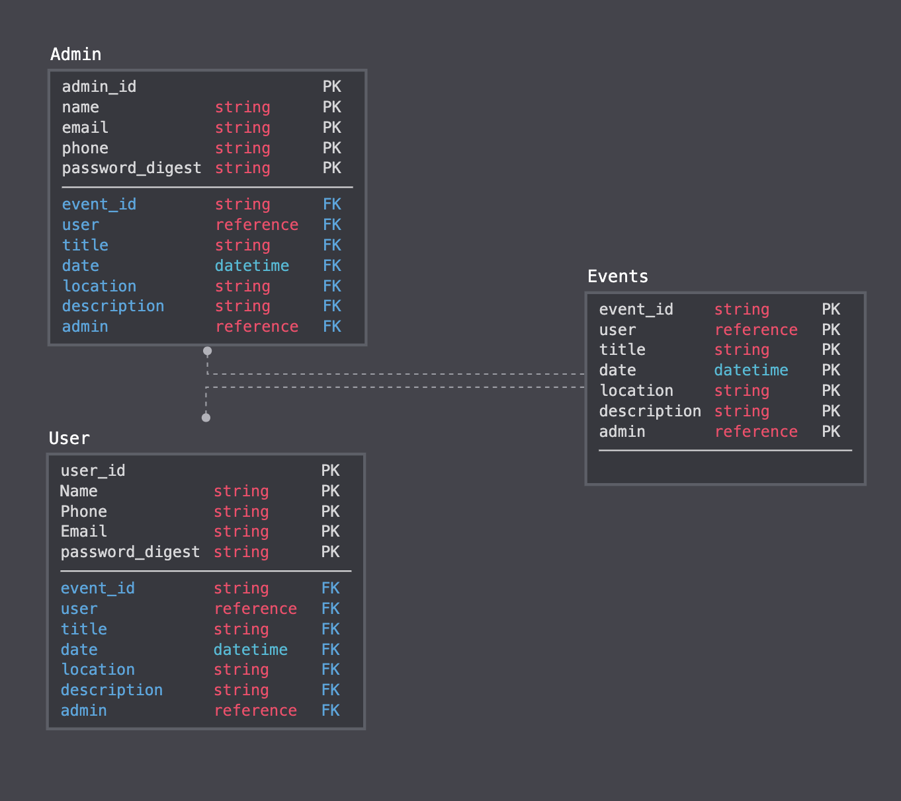

# OctaGo - http://octago.surge.sh/

- [Overview](#Overview)
- [Team](#Team)
- [Problem Statement](#Problem-Statement)
- [MVP](#MVP)
	- [MVP Goals](#MVP-Goals)
	- [MVP Libraries](#MVP-Libraries)
	- [MVP Client (Front End)](#MVP-Client-Front-End)
		- [Wireframes](#Wireframes)
		- [Component Hierarchy](#Component-Hierarchy)
		- [Component Breakdown](#Component-Breakdown)
	- [MVP Server (Back End)](#MVP-Server-Back-End)
		- [ERD Model](#ERD-Model)
	- [Data Flow](#Data-Flow)
- [Post-MVP](#Post-MVP)
- [Code Showcase](#Code-Showcase)

 

## Overview

**OctaGo** is a contacless event administrator tool that allows staff to check people into events while keeping appropriate distanve following COVID protocals. Using geolocation and bluetooth to allow members to check in at a distance and allow for confirmation from staff before entering.
 

## Team

- Lucas Zambelli - User Experience Designer (UX Research & Design)
- Patricia Musat - User Experience Designer (UX Research & Design)
- Artemie Amari - Software Developer (Application Logic & Documentation)
- Llukkah Rey - Software Developer (Server & Authentication)
- Zhan Yu - Data Analyst (User & Event Data)

 

## Problem Statement 
Users need to check into events while maintaining social distancing.

How can we help staff and attendees maintain appropriate distancing while allowing for check in at events?
 

## MVP

One core feature is a geolocation tracker that allows staff to see when attendees arrive so they can give them a green, yellow or red light depending on what the capacity and attendee list looks like.
 
## MVP Libraries and external APIs

 

### MVP Client (Front End)

#### Wireframes

#### Component Hierarchy

#### Component Breakdown

 

### MVP Server (Back End)

#### ERD Model

#### Endpoints

***

## Post-MVP

- Contact in App

